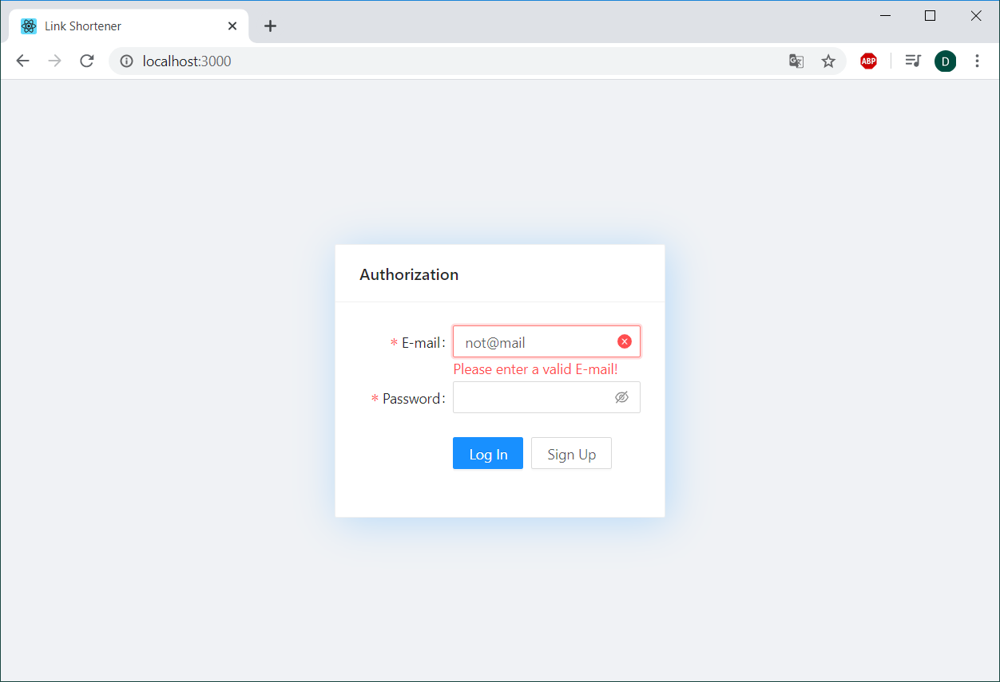
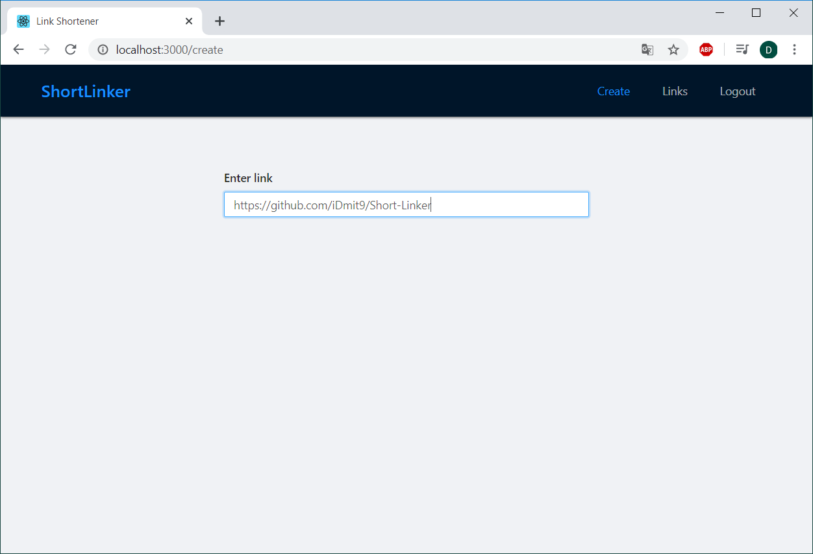
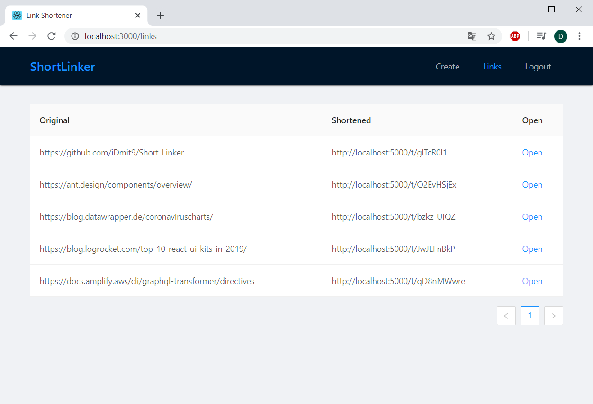

# ShortLinker

This fullstack application allows you to create short links and track how many times someone clicked on them. It was created using the MERN stack (MongoDB, Express, React, Node).

At the entrance you are invited to register and then login. When filling in, validation is done with the built-in "antd" tools (Ant Design React UI library). At the same time, additional validation on the server occurs. To do this, we use the "express-validator". After that, the password is hashed using the "bcryptjs" library and the user is added to the database. After logging in, the user receives a token created using "jsonwebtoken". This token will later confirm that the user is authorized.

After authorization, you get to the link creation page. Here you just need to enter the link for which you want to create a shortened version and press Enter. Once created, you will be redirected to the detailed information page. The original link and the created shortened link will be shown there.

In the menu above you can go to the Links page with all the links created. Here you will see the original URL, a shortened link and a link to detailed page where you can see how many times this short link was opened.

The menu also provides a Logout link. But if you do not leave within an hour, then you will be automatically logged out. This functionality is configured on the server in "jsonwebtoken", where we indicate how long our token expires and then we sent expTime to our application during login.